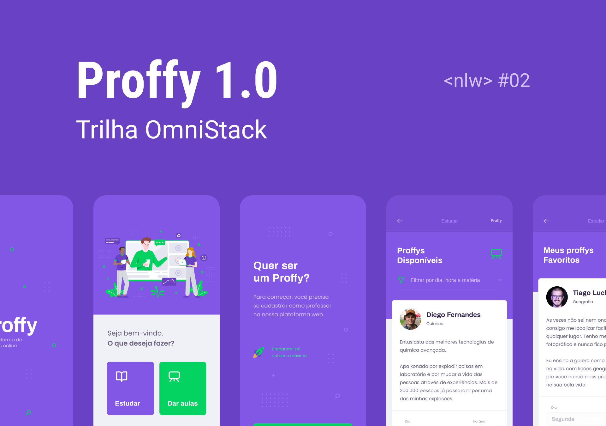

<h1 align="center" width="100">
    
</h1>

<h4 align="center">
    :rocket:  Next Level Week 2.0
    <br />
    :construction:  In construction :construction:
</h4>


<p align="center">

<a href="www.linkedin.com/in/jessica-zimmerhansl">
    
  </a>   
     <a href="https://github.com/jlzimmerhansl/Proffy">
    
  </a>    
                                                                                                         
  <a href="http://github.com/jlzimmerhansl/FacaOBemV03">
    
  </a>  
</p>      

## :bookmark: About the Project

Project made to connect teachers to students,  developed during the Next Level Week 2.0 offered by [RocketSeat][url-rocketseat] :rocket:

## :art: Layout 

Web Version avaible in [Figma][url-figmaWeb]


Mobile Version avaible in [Figma][url-figmaMobile]



## :computer: Technologies

This projects was made using the follow technologies:

* [React][url-react]
* [React-Native][url-react-native]
* [Typescript][url-typescript]
* [Expo][url-expo]
* [Node Js][url-node]

## :construction_worker: How to use?

> :bulb: You must start the server to run the web and mobile versions.

The project was divided in three parts:

1. Server
2. Front-End
3. Mobile

## :package: How to clone the repository?

```bash
$git clone https://github.com/jlzimmerhansl/Proffy.git
```

:rocket: How to run?

```bash
# Go to server folder
$ cd/server

# Install Dependencies
$yarn install

# Create Database
$ yarn knex:migrate

# Run API
$ yarn start

# Run Web 
$ cd/web
$ yarn start

#Run Mobile
$ cd/mobile
$ expo start
```

## :mortar_board: Classes
The classes was taught by [Diego Fernandes][url-diego], and the content was avaible for one week.

---
<h4 align="center">
Made with :purple_heart: by <a href="www.linkedin.com/in/jessica-zimmerhansl" target="_blank">Jessica Zimmerhansl</a>
</h4>


[url-figmaWeb]: https://www.figma.com/file/2FXNJgjSHWAH1vyol3zldy/Proffy_Web?node-id=0%3A1
[url-figmaMobile]: https://www.figma.com/file/bFsQEHirdlrLbSuoSuXUXm/Proffy_Mobile?node-id=0%3A1
[url-typescript]:  https://nodejs.org/pt-br/
[url-react]: https://reactjs.org/
[url-react-native]: https://reactnative.dev/
[url-expo]: https://expo.io/
[url-rocketseat]: https://rocketseat.com.br/
[url-git]: https://git-scm.com/
[url-vs]: https://code.visualstudio.com/
[url-npm]: https://www.npmjs.com/
[url-yarn]: https://yarnpkg.com/
[url-diego]: https://github.com/diego3g
[url-node]: https://nodejs.org/en/
